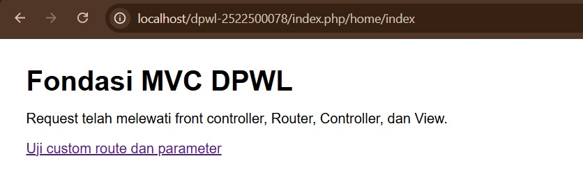
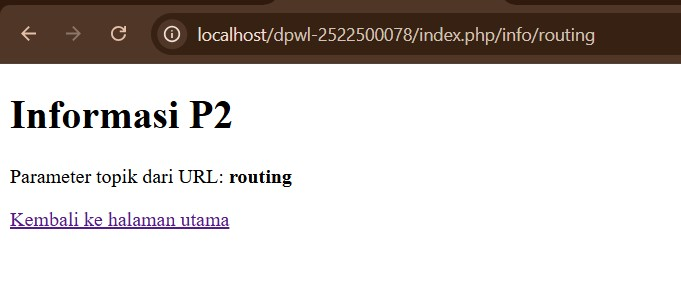

# pertemuan-02

## 1. Tujuan Praktikum
[Jelaskan tujuan P2 dengan kalimat sendiri.]
jawab: Tujuan praktikum P2 adalah memahami dan membuat dasar aplikasi menggunakan konsep MVC secara sederhana. Pada praktikum ini saya belajar bagaimana request dari browser masuk melalui index.php sebagai front controller, kemudian diproses oleh Router dan diteruskan ke Controller sampai menghasilkan View.
    Selain itu, saya juga belajar membuat routing, menggunakan base_url() dan site_url(), serta memahami hubungan antara Controller dan View. Pada P2 ini Model belum digunakan karena pengelolaan database baru akan dilakukan pada P3.

## 2. Struktur Direktori
[Tampilkan tree struktur P2 dan jelaskan fungsi setiap bagian.]
```
jawab: 
dpwl-2522500078/
├── application/
│   ├── config/
│   │   ├── config.php
│   │   └── routes.php
│   ├── controllers/
│   │   └── Home.php
│   ├── helpers/
│   │   └── url_helper.php
│   └── views/
│       └── home/
│           ├── index.php
│           └── info.php
├── assets/
│   └── css/
│       └── app.css
├── system/
│   └── core/
│       ├── Controller.php
│       └── Router.php
├── dokumentasi/
└── index.php
```
## 3. Front controller
[Jelaskan peran index.php sebagai satu titik masuk aplikasi.]
jawab: Front Controller itu ibarat gerbang utama, di mana file index.php jadi satu-satunya pintu masuk buat semua request ke aplikasi.
    Pas buka URL aplikasi, kita gak bisa langsung mengakses file Controller tujuan. Semuanya wajib lewat index.php duluan. Di sini, index.php bakal memuat semua konfigurasi, Helper, Controller, dan Router. Setelah siap, request dikasih ke Router buat menentukan Controller, method, dan parameter mana yang harus berjalan.
    Jadi, gak ada lagi akses langsung ke file tertentu lewat URL. Semua alur masuk harus lewat index.php dulu, baru didelegasikan ke proses berikutnya.

## 4. Routing dan Pemetaan URL
| URL/Route | Controller | Method | Parameter | View |
|---|---|---|---|---|
| / | Home | index | - | home/index.php |
| home/index | Home | index | - | home/index.php |
| home/info/mvc | Home | info | mvc | home/info.php |
| info/routing | Home | info | routing | home/info.php |
| pasien/info/001 | pasien | info | 001 | pasien/info.php |

Tambahkan satu baris untuk route hasil Tahap Modifikasi ATM yang dibuat berdasarkan objek atau konteks
aplikasi DPW, kemudian jelaskan pemetaan route → Controller → method → parameter → View.
jawab: Ketika URL tersebut dibuka, Router akan membaca pasien sebagai Controller, info sebagai method, dan 001 sebagai parameter. Kemudian Controller Pasien menjalankan method info() dengan parameter 001. Setelah itu Controller memanggil View pasien/info.php untuk menampilkan informasi berdasarkan parameter tersebut.

## 5. Base URL dan Helper
Jelaskan fungsi base_url() dan site_url(), kemudian berikan contoh penggunaannya pada implementasi P2:
- base_url() untuk memanggil assets/css/app.css;
- site_url() untuk membentuk URL navigasi/route aplikasi.
jawab: base_url() dan site_url() digunakan untuk membantu membentuk alamat URL sehingga tidak perlu menulis alamat secara manual berulang kali.

base_url()

base_url() digunakan untuk mendapatkan alamat dasar aplikasi dan biasanya digunakan untuk memanggil file pendukung seperti CSS, JavaScript, gambar, dan asset lainnya.

Contoh penggunaan pada P2:

`<link rel="stylesheet" href="<?= base_url('assets/css/app.css') ?>">`

Hasil URL-nya menjadi:

http://localhost/dpwl-2522500078/assets/css/app.css

Jadi, base_url() digunakan untuk memanggil asset aplikasi.

site_url()

site_url() digunakan untuk membuat URL yang mengarah ke route aplikasi.

Contohnya:

`<a href="<?= site_url('info/routing') ?>">
    Uji custom route dan parameter
</a>`

Hasil URL-nya:

http://localhost/dpwl-2522500078/index.php/info/routing

Jadi, site_url() lebih digunakan untuk navigasi atau menuju route yang diproses oleh aplikasi.

## 6. Alur Request-response
Jelaskan dua alur berikut:
1. Alur eksekusi aktual P2:
Browser → index.php → Router → Controller → View → Response.
2. Posisi Model dalam arsitektur MVC lengkap:
Browser → index.php → Router → Controller → Model → basis data/data → Model → Controller → View →
Response.
Pada implementasi P2, Model belum digunakan karena akses dan pengelolaan basis data mulai
diimplementasikan pada P3.
jawab:  1. Alur eksekusi pada P2 dimulai ketika pengguna mengakses aplikasi melalui browser. Request dari browser pertama kali masuk ke index.php yang berfungsi sebagai front controller atau satu pintu masuk utama aplikasi. Selanjutnya, Router membaca URL dan menentukan Controller serta method yang sesuai berdasarkan route yang telah dibuat.
    Setelah itu, request diteruskan ke Controller untuk diproses. Controller menyiapkan data yang diperlukan dan menentukan View yang akan digunakan. View kemudian mengolah data tersebut menjadi halaman HTML yang akan ditampilkan kepada pengguna.

2. Penjelasannya, setelah request diterima oleh Controller, Controller dapat meminta Model untuk mengambil atau mengolah data. Model kemudian berhubungan dengan basis data atau sumber data. Data yang diperoleh dikembalikan ke Model, kemudian diteruskan ke Controller.
    Selanjutnya, Controller memberikan data tersebut kepada View untuk ditampilkan dalam bentuk halaman HTML. Hasilnya kemudian dikirim kembali ke browser sebagai Response.

## 7. Hasil Pengujian dan Debugging
Catat skenario pengujian valid dan tidak valid beserta hasilnya. Jika ditemukan kesalahan selama
implementasi, dokumentasikan sekurang-kurangnya satu proses debugging yang memuat:
Gejala → Penyebab → Perbaikan → Hasil Uji Ulang
Jika seluruh implementasi langsung berjalan sesuai hasil yang diharapkan, jelaskan hasil pemeriksaan
sintaks dan pengujian yang telah dilakukan.
jawab: Pada saat proses implementasi, ditemukan kesalahan ketika melakukan proses penyalinan file menggunakan perintah robocopy pada terminal.

Gejala:
    Terminal menampilkan pesan “ERROR 2 ... The system cannot find the file specified” ketika proses robocopy dijalankan. Pada percobaan sebelumnya juga terdapat pesan “Cannot find path ... because it does not exist” ketika masuk ke folder project menggunakan perintah cd.

Penyebab:
    Path atau lokasi folder yang digunakan pada perintah tidak sesuai dengan lokasi folder project yang sebenarnya. Akibatnya, PowerShell tidak dapat menemukan folder yang dituju.

Perbaikan:
    Path folder diperiksa dan disesuaikan dengan lokasi project yang benar. Setelah berhasil masuk ke folder project, perintah robocopy dijalankan kembali dengan source dan destination yang sesuai.

Hasil Uji Ulang:
    Setelah path diperbaiki, proses robocopy dapat berjalan dan menampilkan proses penyalinan file, seperti index.php, config.php, dan file lainnya ke dalam project. Dengan demikian, masalah path pada proses sebelumnya sudah berhasil diperbaiki.
Selain itu, struktur project juga diperiksa melalui Visual Studio Code. File seperti url_helper.php, Home.php, Controller.php, Router.php, routes.php, dan index.php sudah berada pada struktur folder yang sesuai dengan implementasi P2.

## 8. Bukti Tangkapan Layar
Sisipkan gambar yang relevan dari folder dokumentasi/ dengan perintah:
### Gambar 1. Hasil Pengujian Halaman Utama

### Gambar 2. Hasil Pengujian Custom Route

## 9. Kesimpulan P2
Jelaskan apa yang sudah dapat dilakukan kerangka MVC dan apa yang baru akan ditambahkan pada P3.
jawab: Pada praktikum P2 saya sudah memahami dasar penggunaan pola MVC dengan membuat kerangka MVC sederhana sendiri. Aplikasi sudah memiliki index.php sebagai front controller, Router untuk mengatur route, Controller untuk menangani request, dan View untuk menampilkan hasil ke browser.
    Saya juga sudah dapat membuat route biasa maupun custom route, meneruskan parameter dari URL ke Controller, menggunakan base_url() untuk memanggil asset dan site_url() untuk membuat URL navigasi.
    Pada P2 Model belum digunakan karena fokusnya masih pada fondasi MVC dan routing. Pada P3, kerangka ini akan dikembangkan dengan menambahkan Model, koneksi ke database, pengelolaan data menggunakan MySQLi/prepared statement, autentikasi, session, kontrol akses, serta integrasi AdminLTE.